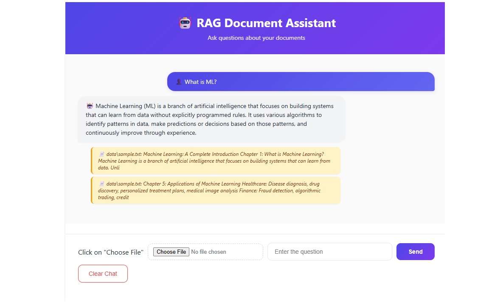
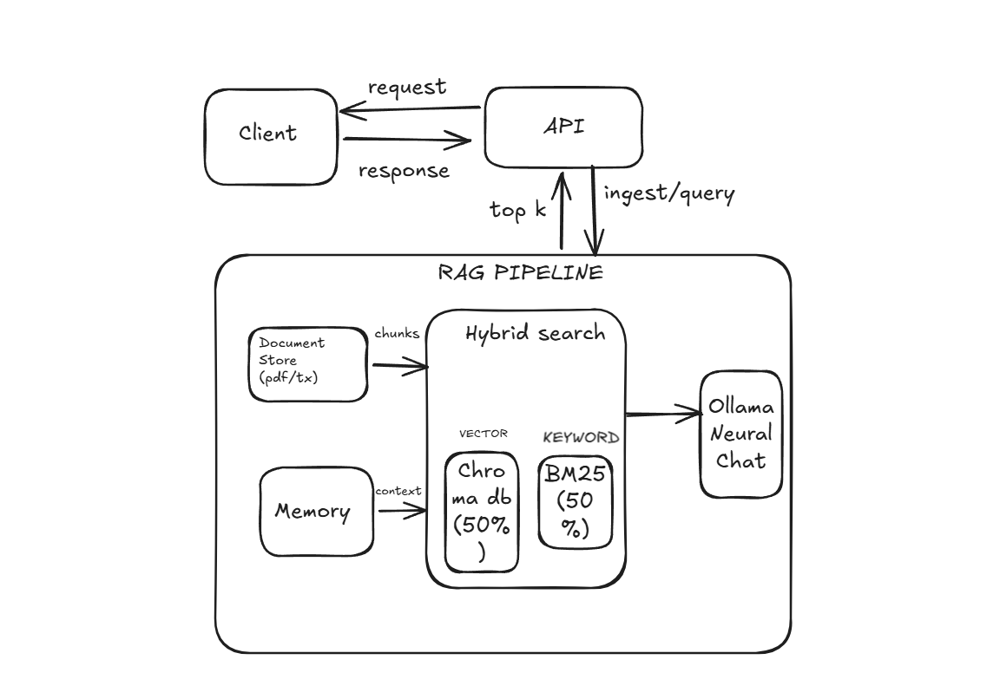

# 🤖 RAG Document Assistant

A full-stack Retrieval-Augmented Generation chat application that lets users upload documents and ask questions.

---

## 📋 Description

## 📋 Description

This chatbot parses uploaded documents, understands the content, 
and answers questions based on what's in those documents.

The entire project is built on a RAG (Retrieval-Augmented Generation) 
pipeline. Neural Chat is the brain of the model - it reads the context 
retrieved from your documents and generates answers.

For storing and retrieving documents, I used a hybrid search approach 
combining ChromaDB (semantic vector search) and BM25 (keyword search). 
This combination gives better results than using either one alone - 
semantic search understands meaning while keyword search catches exact 
terms.

Built this from scratch as my first full-stack ML project - learned 
a ton about how RAG systems actually work under the hood!


---

## ✨ Features

- 🔍 **Hybrid Search** - Combines vector (ChromaDB) and keyword (BM25) search for accurate retrieval
- 📚 **Source Attribution** - Every answer includes source documents with previews and page numbers
- 💬 **Conversation Memory** - Remembers context across multiple questions (multi-turn chat)
- 📤 **File Upload** - Upload PDF or TXT documents directly through the UI
- ⏳ **Loading Indicators** - Real-time status updates while AI processes
- 🗑️ **Clear Chat** - Reset conversation and start fresh
- ⌨️ **Keyboard Shortcuts** - Press Enter to send messages
- 🎨 **Modern UI** - Beautiful gradient design with chat bubbles
- 🔒 **Privacy-First** - All processing happens locally (no external API calls)

---

## 🛠️ Tech Stack

### Backend
- **Python 3.11+** - Core language
- **FastAPI** - Modern async web framework
- **Uvicorn** - ASGI server
- **Pydantic** - Data validation

### AI/ML
- **LangChain** - LLM orchestration framework
- **Ollama** - Local LLM runtime
- **Neural Chat** - LLM for response generation
- **Nomic Embed Text** - Embedding model
- **ChromaDB** - Vector database
- **BM25** - Keyword search algorithm

### Frontend
- **HTML5** - Structure
- **CSS3** - Styling with gradients and animations
- **Vanilla JavaScript** - No frameworks, pure JS!
- **Fetch API** - Backend communication

---

## 📸 Screenshots


### Chat in Action & Source Citations


### System Design


---

## 🚀 Installation

### Prerequisites

- **Python 3.11+** installed
- **Ollama** installed ([Download here](https://ollama.com/download))
- **Git** installed
- **4GB+ RAM** recommended
- **Windows/Mac/Linux** supported

### Setup Steps

1. **Clone the repository**
```bash
   git clone https://github.com/Soundarya0512/RAG-DOCUMENT-ASSISTANT.git
   cd RAG-DOCUMENT-ASSISTANT
```

2. **Pull Ollama models** (one-time setup)
```bash
   ollama pull neural-chat
   ollama pull nomic-embed-text
```

3. **Create virtual environment**
```bash
   python -m venv venv
   
   # On Windows:
   venv\Scripts\activate
   
   # On Mac/Linux:
   source venv/bin/activate
```

4. **Install dependencies**
```bash
   pip install -r requirements.txt
```

5. **Add documents to data folder**
   - Place any PDF or TXT files in the `data/` folder
   - A sample.txt is included for testing

6. **Run the application**
```bash
   python -m app.main
```

7. **Open in browser**

---

## 💻 Usage

1. **Start the server** by running `python -m app.main`
2. **Open** `http://localhost:8000/` in your browser
3. **Upload documents** using the "Choose File" button (PDF or TXT supported)
4. **Type your question** in the input box
5. **Press Enter** or click "Send" to ask
6. **View the response** with source citations
7. **Continue chatting** - the bot remembers previous context
8. **Clear chat** to start a fresh conversation

---

## 🔌 API Endpoints

| Endpoint | Method | Description |
|----------|--------|-------------|
| `/` | GET | Serves the frontend |
| `/health` | GET | Health check endpoint |
| `/query` | POST | Single-turn Q&A without memory |
| `/query_with_history` | POST | Multi-turn chat with conversation memory |
| `/upload` | POST | Upload document (PDF/TXT) for ingestion |
| `/ingest` | POST | Manually trigger document ingestion |
| `/clear_history` | POST | Clear conversation memory |

---

## 🏗️ Architecture

### How It Works

1. **Document Ingestion**: Files are loaded, split into chunks (1500 chars), and embedded using `nomic-embed-text`
2. **Vector Storage**: Embeddings stored in ChromaDB for semantic search
3. **Keyword Index**: BM25 retriever built for keyword matching
4. **Query Processing**: User query goes through both retrievers (50/50 weight)
5. **Response Generation**: Top chunks + query sent to Neural Chat LLM
6. **Source Attribution**: Returns answer with cited sources

---

## 🔮 Future Improvements

- [ ] **Stream Processing** - Handle large PDFs (100MB+) without memory issues
- [ ] **Streaming Responses** - Word-by-word output like ChatGPT
- [ ] **Cloud Deployment** - Deploy to Hugging Face Spaces with Groq LLM
- [ ] **Multi-User Support** - User authentication and personal chat histories
- [ ] **Multi-Modal RAG** - Support for images alongside text
- [ ] **Mobile App** - React Native version
- [ ] **Document Management** - List, delete, and organize uploaded files
- [ ] **Export Conversations** - Download chat history as PDF/TXT

---

## 👩‍💻 Author

**Soundarya**
- GitHub: [@Soundarya0512](https://github.com/Soundarya0512)
- LinkedIn: [linkedin.com/in/soundarya-kishore](https://www.linkedin.com/in/soundarya-kishore/)

---

## 🙏 Acknowledgments

- **Ollama** for local LLM inference
- **LangChain** for the RAG framework
- **ChromaDB** for vector storage
- **FastAPI** for the amazing web framework

---

## 📄 License

This project is open source and available for educational purposes.

---

⭐ If you find this project helpful, please star the repository!